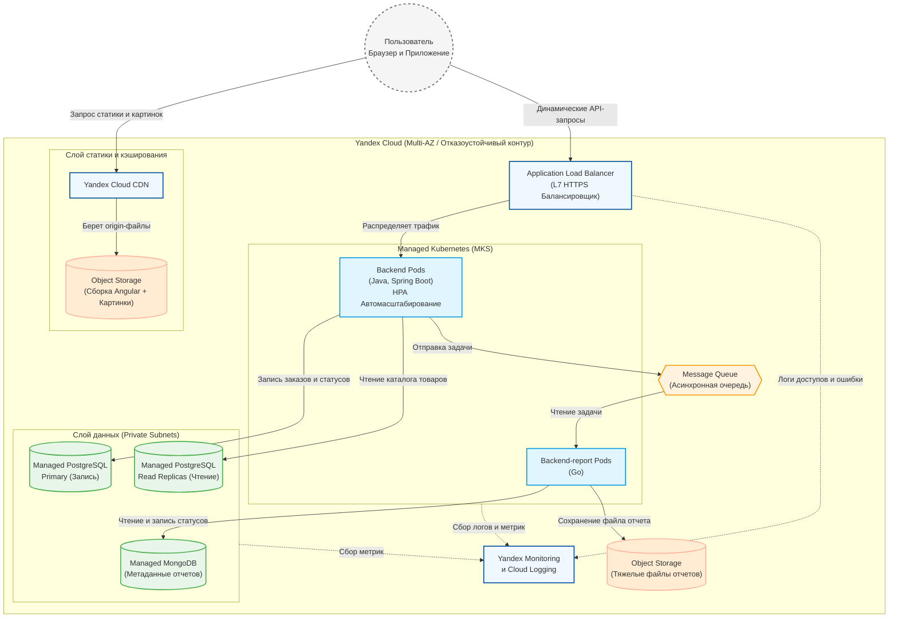

```mermaid
graph TD
    %% Стили для различных компонентов
    classDef cloud fill:#f0f8ff,stroke:#00509e,stroke-width:2px;
    classDef storage fill:#ffecd2,stroke:#fcb69f,stroke-width:2px;
    classDef compute fill:#e1f5fe,stroke:#039be5,stroke-width:2px;
    classDef db fill:#e8f5e9,stroke:#4caf50,stroke-width:2px;
    classDef queue fill:#fff3e0,stroke:#ff9800,stroke-width:2px;
    classDef external fill:#f5f5f5,stroke:#666,stroke-width:2px,stroke-dasharray: 5 5;

    User((Пользователь<br/>Браузер и Приложение)):::external

    subgraph YandexCloud["Yandex Cloud (Multi-AZ / Отказоустойчивый контур)"]
        
        subgraph Static_Layer["Слой статики и кэширования"]
            CDN["Yandex Cloud CDN"]:::cloud
            S3_Static[("Object Storage<br/>(Сборка Angular + Картинки)")]:::storage
        end

        ALB["Application Load Balancer<br/>(L7 HTTPS Балансировщик)"]:::cloud

        subgraph K8S ["Managed Kubernetes (MKS)"]
            Backend["Backend Pods<br/>(Java, Spring Boot)<br/>HPA Автомасштабирование"]:::compute
            ReportWorker["Backend-report Pods<br/>(Go)"]:::compute
        end

        MQ{{"Message Queue<br/>(Асинхронная очередь)"}}:::queue

        subgraph Databases ["Слой данных (Private Subnets)"]
            PG_Primary[("Managed PostgreSQL<br/>Primary (Запись)")]:::db
            PG_Replica[("Managed PostgreSQL<br/>Read Replicas (Чтение)")]:::db
            Mongo[("Managed MongoDB<br/>(Метаданные отчетов)")]:::db
        end

        S3_Reports[("Object Storage<br/>(Тяжелые файлы отчетов)")]:::storage
        
        Monitoring["Yandex Monitoring<br/>и Cloud Logging"]:::cloud

    end

    %% Маршрутизация трафика
    User -->|Запрос статики и картинок| CDN
    CDN -->|Берет origin-файлы| S3_Static
    
    User -->|Динамические API-запросы| ALB
    ALB -->|Распределяет трафик| Backend
    
    %% Взаимодействие Backend с базами
    Backend -->|Запись заказов и статусов| PG_Primary
    Backend -->|Чтение каталога товаров| PG_Replica
    
    %% Асинхронный контур отчетов
    Backend -->|Отправка задачи| MQ
    MQ -->|Чтение задачи| ReportWorker
    
    %% Работа с отчетами
    ReportWorker -->|Чтение и запись статусов| Mongo
    ReportWorker -->|Сохранение файла отчета| S3_Reports
    
    %% Мониторинг (пунктир)
    K8S -.->|Сбор логов и метрик| Monitoring
    Databases -.->|Сбор метрик| Monitoring
    ALB -.->|Логи доступов и ошибки| Monitoring
```