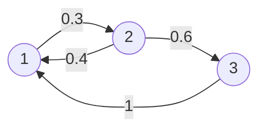

## из лекции?
```
есть короче вот такой вот конспект почириканный от Ирины Кошаевой, в котором все в общем виде написано, но я искренне нихрена не понимаю, мне проще на примере это расписать.
```
![[12 тетрадка.png]]

## с практики

пусть дана цепь Маркова. $\mathbb P$ — матрица перехода, $P = (P_1,\ ...,\ P_n)$ — предельная вероятность.

входящий поток вероятностей равен исходящему.
то есть у нас есть состояния $i$ и $j$, тогда $P_i \cdot \mathbb P_{ij}$ — поток вероятностей из состояния $i$ в состояние $j$. то есть вероятность сейчас находиться в состоянии $P_i$ умножить на $i$-тое $j$-тое значение в матрице перехода.

$$\underset{\text{исходящий поток}}{\underset{\begin{array}{c}i \ne j \\ i=1 \end{array}}{\overset{n}{\sum}} P_j \cdot \mathbb P_{ji}} = \underset{\text{входящий поток}}{\underset{\begin{array}{c}i \ne j \\ i=1 \end{array}}{\overset{n}{\sum}} P_i \cdot \mathbb P_{ij}}$$

рассмотрим теперь пример.

$\mathbb P = \left(\begin{array}{ccc}0.7 & 0.3 & 0 \\0.4 & 0 & 0.6 \\1 & 0 & 0 \end{array}\right)$


начальное состояние: $P_0 = (0.5,\ 0.3,\ 0.2)$
проверяем, что в матрице перехода не будет отрицательных значений в больших степенях:
$\mathbb P^2 = \left(\begin{array}{ccc}0.61 & 0.21 & 0.18 \\ 0.88 & 0.12 & 0 \\ 0.7 & 0.3 & 0 \end{array}\right)\qquad \mathbb P^3 = \left(\begin{array}{ccc}0.691 & 0.183 & 0.126 \\ 0.664 & 0.264 & 0.072 \\ 0.61 & 0.21 & 0.18 \end{array}\right)$
ну, вроде норм!

составляем систему по принципу слева исходящий поток для вершины графа, справа входящий поток для этой вершины. так перебираем все вершины. одно уравнение выкидываем, дописываем уравнение $P_1 + P_2 + P_3 = 1$ и решаем.

$\begin{cases}P_1 \cdot 0.3 = P_2 \cdot 0.4 + P_3 \cdot 1 \\ \cancel{P_2 \cdot 1 = P_1 \cdot 0.3} \\ P_3 \cdot 1 = P_2 \cdot 0.6 \\  P_1 + P_2 + P_3 = 1\end{cases} \qquad \qquad \text{ответ:} \quad\begin{array}{c}P_1 = \dfrac{50}{74} \\ P_2 = \dfrac{15}{74} \\ P_3 = \dfrac{9}{74} \end{array}$

получается, вектор предельных вероятностей равен $P = \left(\dfrac{50}{74},\ \dfrac{15}{74},\ \dfrac{9}{74}\right)$.

```
я уж не буду еще подробнее расписывать, как я систему составляла? просто на граф смотрим и переписываем суммы со стрелочек.

а еще, видали как круто?! граф в mermaid разметке!!! теперь буду иногда их пихать по возможности, потому что они векторные и легче, т. к. не являются картинкой. но иногда от руки бахнуть все же быстрее.
```